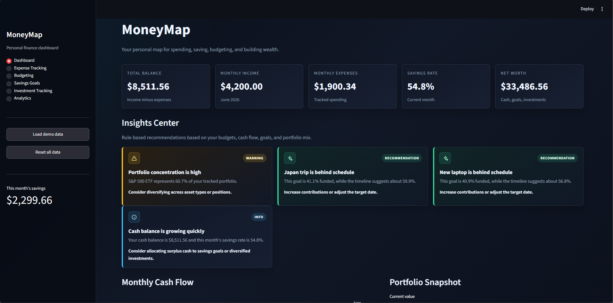
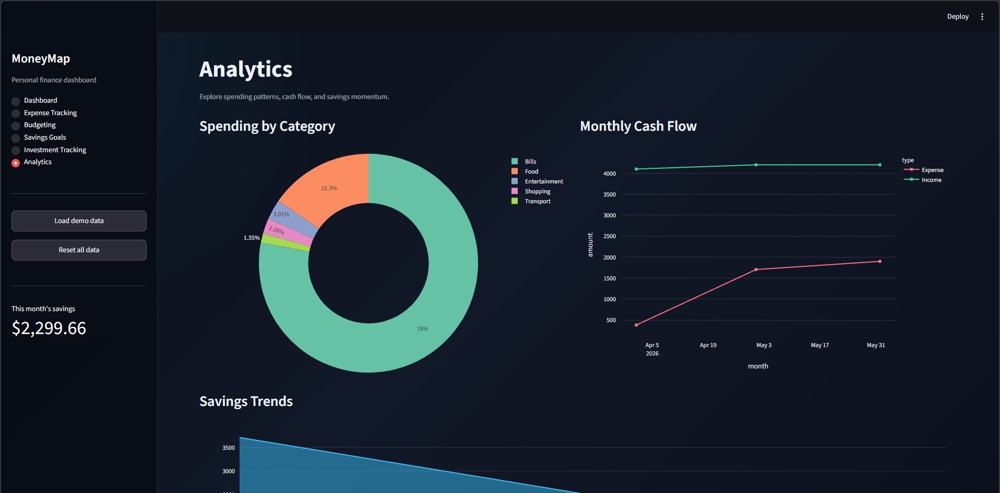
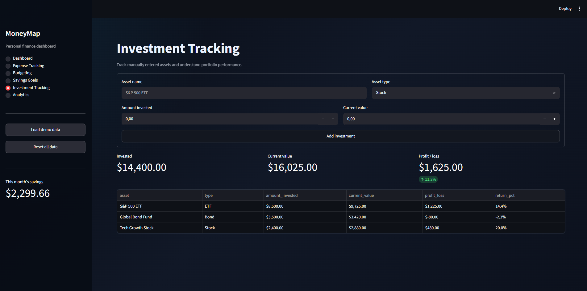

# MoneyMap

MoneyMap is a modern personal finance dashboard built with Python and Streamlit. It helps users understand their cash flow, track expenses, manage budgets, monitor savings goals, and review investment performance from one clean local application.

The project is designed to be portfolio-ready, beginner-friendly, and easy to run without external services or account connections.

## Project Overview

MoneyMap stores user data locally in `data/moneymap_data.json`, which is created automatically on first run. The app uses a professional dark interface, sidebar navigation, interactive charts, polished empty states, and demo data so new users can explore the full experience immediately.

Core areas include:

- A high-level dashboard for balances, income, expenses, savings rate, and net worth
- Transaction tracking for both income and expenses
- Monthly budgeting with usage indicators and overspending warnings
- Savings goal tracking with progress percentages and target dates
- Manual investment tracking with profit/loss calculations
- Rule-based financial insights without using AI
- Analytics charts for spending, cash flow, and savings trends

## Problem Statement

Personal finance data is often scattered across bank apps, spreadsheets, budgeting tools, and investment platforms. This makes it harder to answer simple questions like:

- Where is my money going this month?
- Am I staying within my budget?
- Are my savings goals on track?
- Is my portfolio too concentrated?
- How is my cash flow changing over time?

MoneyMap solves this by bringing everyday personal finance tracking into one lightweight dashboard that runs locally and keeps the code approachable for learners.

## Features

- **Dashboard metrics:** Total balance, monthly income, monthly expenses, savings rate, and estimated net worth.
- **Insights Center:** Rule-based recommendations with severity badges, icons, hover states, and polished insight cards.
- **Expense tracking:** Add income and expense entries with categories, descriptions, dates, and amounts.
- **Transaction history:** View a clean table of all logged transactions.
- **Budgeting:** Set category budgets and monitor usage with progress bars.
- **Overspending warnings:** Automatically flag categories that exceed their monthly budget.
- **Savings goals:** Create savings goals, track progress, and monitor target dates.
- **Investment tracking:** Add assets manually and calculate profit/loss and return percentage.
- **Analytics:** Visualize spending by category, monthly cash flow, savings trends, and goal completion.
- **Demo data:** Load sample data from the sidebar to explore the full dashboard quickly.
- **Local storage:** Persist data in JSON without a database setup.
- **Polished empty states:** Helpful UI when sections do not have data yet.

## Technologies Used

- **Python** for application logic
- **Streamlit** for the interactive web interface
- **Pandas** for data manipulation and summaries
- **Plotly** for interactive charts
- **JSON** for lightweight local persistence
- **CSS** for custom dark-theme styling and dashboard cards

## Screenshots

### Dashboard



### Analytics



### Investments



## Installation Instructions

1. Clone the repository.

   ```bash
   git clone <repository-url>
   cd moneymap
   ```

2. Create and activate a virtual environment.

   ```bash
   python -m venv .venv
   .venv\Scripts\activate
   ```

   On macOS or Linux:

   ```bash
   source .venv/bin/activate
   ```

3. Install dependencies.

   ```bash
   pip install -r requirements.txt
   ```

4. Run the Streamlit app.

   ```bash
   streamlit run app.py
   ```

5. Open the local URL shown in the terminal, usually:

   ```text
   http://localhost:8501
   ```

## Future Improvements

- Add CSV import and export for transactions
- Support recurring income, bills, and subscriptions
- Add edit and delete actions for records
- Allow custom spending categories
- Add multi-currency support
- Add monthly budget templates
- Add authentication for deployed versions
- Add optional market data integration for investment prices
- Add forecasting tools for savings and cash flow projections
- Add downloadable reports for monthly finance reviews

## License

This project is available under the MIT License. You are free to use, modify, and share it for personal, educational, or portfolio purposes.
